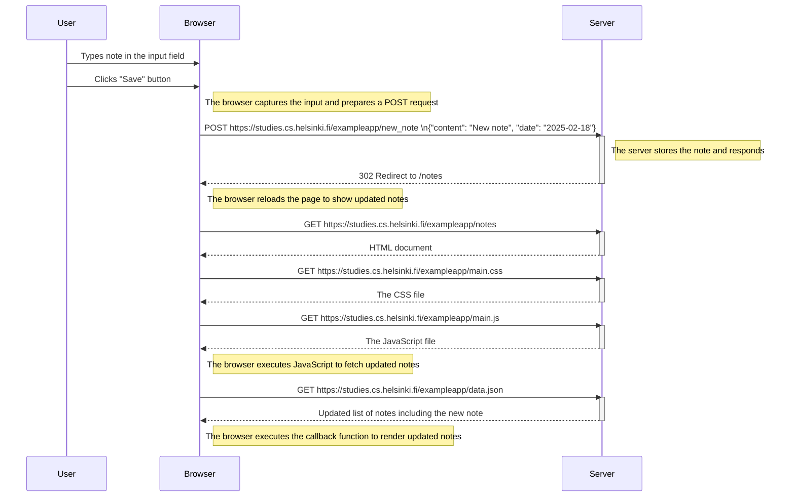

```mermaid
sequenceDiagram
    participant User
    participant Browser
    participant Server

    User->>Browser: Types note in the input field
    User->>Browser: Clicks "Save" button

    Note right of Browser: The browser captures the input and prepares a POST request

    Browser->>Server: POST https://studies.cs.helsinki.fi/exampleapp/new_note \n{"content": "New note", "date": "2025-02-18"}
    activate Server

    Note right of Server: The server stores the note and responds

    Server-->>Browser: 302 Redirect to /notes
    deactivate Server

    Note right of Browser: The browser reloads the page to show updated notes

    Browser->>Server: GET https://studies.cs.helsinki.fi/exampleapp/notes
    activate Server
    Server-->>Browser: HTML document
    deactivate Server

    Browser->>Server: GET https://studies.cs.helsinki.fi/exampleapp/main.css
    activate Server
    Server-->>Browser: The CSS file
    deactivate Server

    Browser->>Server: GET https://studies.cs.helsinki.fi/exampleapp/main.js
    activate Server
    Server-->>Browser: The JavaScript file
    deactivate Server

    Note right of Browser: The browser executes JavaScript to fetch updated notes

    Browser->>Server: GET https://studies.cs.helsinki.fi/exampleapp/data.json
    activate Server
    Server-->>Browser: Updated list of notes including the new note
    deactivate Server

    Note right of Browser: The browser executes the callback function to render updated notes
```
