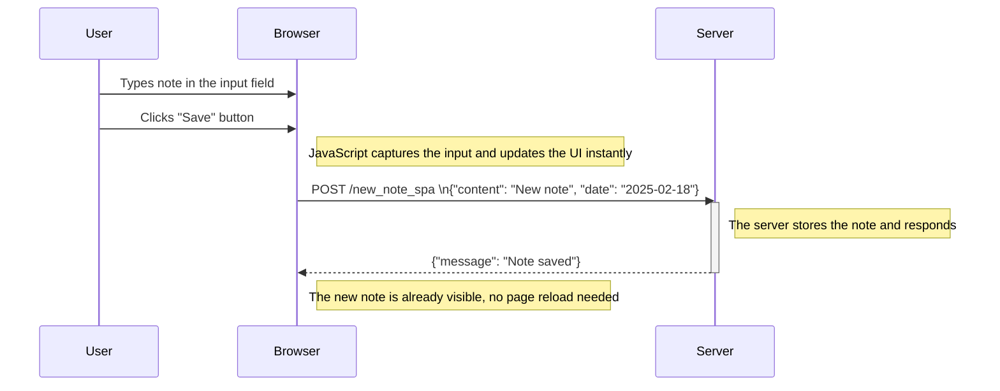

```mermaid
sequenceDiagram
    participant User
    participant Browser
    participant Server

    User->>Browser: Types note in the input field
    User->>Browser: Clicks "Save" button

    Note right of Browser: JavaScript captures the input and updates the UI instantly

    Browser->>Server: POST /new_note_spa \n{"content": "New note", "date": "2025-02-18"}
    activate Server

    Note right of Server: The server stores the note and responds

    Server-->>Browser: {"message": "Note saved"}
    deactivate Server

    Note right of Browser: The new note is already visible, no page reload needed
```
