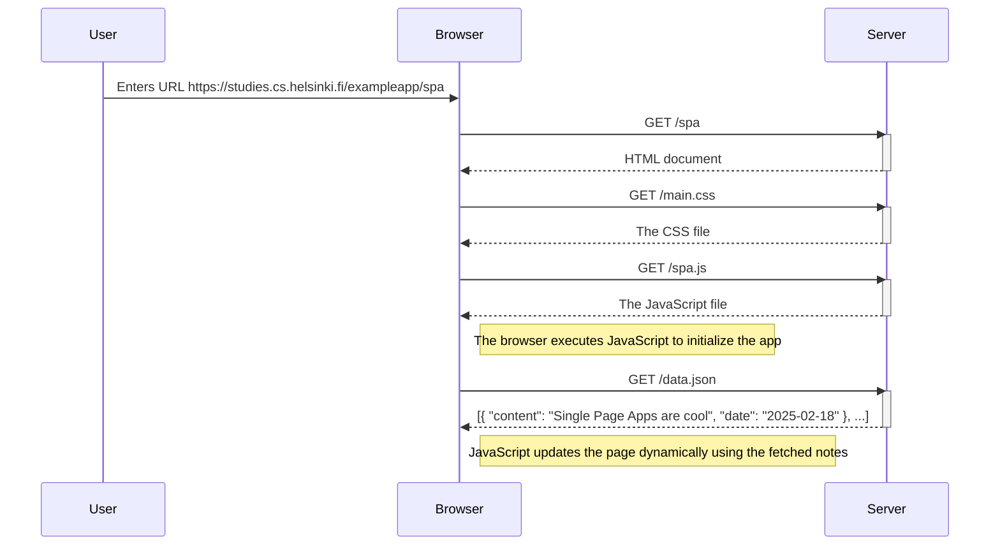

```mermaid
sequenceDiagram
    participant User
    participant Browser
    participant Server

    User->>Browser: Enters URL https://studies.cs.helsinki.fi/exampleapp/spa

    Browser->>Server: GET /spa
    activate Server
    Server-->>Browser: HTML document
    deactivate Server

    Browser->>Server: GET /main.css
    activate Server
    Server-->>Browser: The CSS file
    deactivate Server

    Browser->>Server: GET /spa.js
    activate Server
    Server-->>Browser: The JavaScript file
    deactivate Server

    Note right of Browser: The browser executes JavaScript to initialize the app

    Browser->>Server: GET /data.json
    activate Server
    Server-->>Browser: [{ "content": "Single Page Apps are cool", "date": "2025-02-18" }, ...]
    deactivate Server

    Note right of Browser: JavaScript updates the page dynamically using the fetched notes
```
